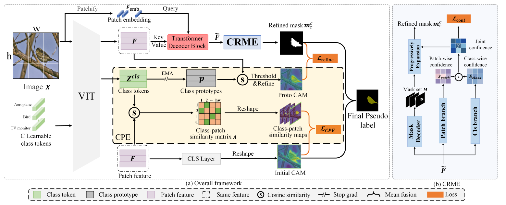

# Weakly Supervised Semantic Segmentation via Progressive Confidence Region Expansion

[](https://opensource.org/licenses/MIT)
[](https://openaccess.thecvf.com/content/CVPR2025/html/Xu_Weakly_Supervised_Semantic_Segmentation_via_Progressive_Confidence_Region_Expansion_CVPR_2025_paper.html)

This repository contains the official PyTorch implementation for the paper: **Weakly Supervised Semantic Segmentation via Progressive Confidence Region Expansion**.

## 📖 Introduction
Weakly supervised semantic segmentation (WSSS) has garnered considerable attention due to its effective reduction of annotation costs. Most approaches utilize Class Activation Maps (CAM) to produce pseudo-labels, thereby localizing target regions using only image-level annotations. However, the prevalent methods relying on vision transformers (ViT) encounter an "over-expansion" issue, i.e., CAM incorrectly expands high activation value from the target object to the background regions, as it is difficult to learn pixel-level local intrinsic inductive bias in ViT from weak supervisions. To solve this problem, we propose a Progressive Confidence Region Expansion (PCRE) framework for WSSS, it gradually learns a faithful mask over the target region and utilizes this mask to correct the confusion in CAM. PCRE has two key components: Confidence Region Mask Expansion (CRME) and Class-Prototype Enhancement (CPE). CRME progressively expands the mask in the small region with the highest confidence, eventually encompassing the entire target, thereby avoiding unintended CPE aims to enhance mask generation in CRME by leveraging the similarity between the learned, dataset-level class prototypes and patch features as supervision to optimize the mask output from CRME. Extensive experiments demonstrate that our method outperforms the existing single-stage and multi-stage approaches on the PASCAL VOC and MS COCO benchmark datasets.

<p align="center">
  
</p>

---

## 📊 Main Results

Here we report the performance of our PCRE method on the PASCAL VOC 2012 and MS COCO 2014 datasets.

| Dataset | Backbone | Val mIoU | Test mIoU | Visualization |
| :---: | :---: | :---: | :---: | :---: |
| PASCAL VOC | ViT-B | 75.5 | 75.9 | [Weights](https://drive.google.com/drive/folders/12DxyZ8m7SeuoCmoisURi55_u5_IVq41P) \| [Vis](https://drive.google.com/drive/folders/12DxyZ8m7SeuoCmoisURi55_u5_IVq41P) |
| MS COCO | ViT-B | 47.2 | -- | [Weights](https://drive.google.com/drive/folders/12DxyZ8m7SeuoCmoisURi55_u5_IVq41P) \| [Vis_Part](https://drive.google.com/drive/folders/12DxyZ8m7SeuoCmoisURi55_u5_IVq41P) |

---

## 🛠️ Environment Setup

Clone the repository and install the required dependencies:

```bash
git clone [https://github.com/xxf011/WSSS-PCRE](https://github.com/xxf011/WSSS-PCRE)
cd PCRE
pip install -r ./requirements.txt
```

### Using the Regularized Loss
To utilize the regularized loss, you need to download and build the required Python extension module. Please refer to the official instructions [here](https://github.com/meng-tang/rloss/tree/master/pytorch#build-python-extension-module).

---

## 📂 Dataset Preparation

### PASCAL VOC Dataset
To prepare the PASCAL VOC dataset, follow these steps:

1. **Download the Dataset**:
   ```bash
   wget [http://host.robots.ox.ac.uk/pascal/VOC/voc2012/VOCtrainval_11-May-2012.tar](http://host.robots.ox.ac.uk/pascal/VOC/voc2012/VOCtrainval_11-May-2012.tar)
   tar -xvf VOCtrainval_11-May-2012.tar
   ```

2. **Augment the Annotations**:
   Download the additional segmentation annotations from the [SBD Dataset](http://home.bharathh.info/pubs/codes/SBD/download.html). After unzipping `SegmentationClassAug.zip`, move the folder to `VOCdevkit/VOC2012`. Ensure the folder structure looks like this:

   ```text
   VOCdevkit/
   └── VOC2012
       ├── Annotations
       ├── ImageSets
       ├── JPEGImages
       ├── SegmentationClass
       ├── SegmentationClassAug
       └── SegmentationObject
   ```

### MS COCO Dataset
To use the COCO dataset:

1. **Download the Images**:
   ```bash
   wget [http://images.cocodataset.org/zips/train2014.zip](http://images.cocodataset.org/zips/train2014.zip)
   wget [http://images.cocodataset.org/zips/val2014.zip](http://images.cocodataset.org/zips/val2014.zip)
   ```

2. **Generate VOC-style Labels**:
   Use the [coco2voc](https://github.com/alicranck/coco2voc) script to convert COCO annotations into a VOC-compatible format:

   ```text
   MSCOCO/
   ├── coco2014
   │   ├── train2014
   │   └── val2014
   └── SegmentationClass
       ├── train2014
       └── val2014
   ```

---

## 🚀 Training

Start the training process using the following commands:

- **For PASCAL VOC**:
  ```bash
  CUDA_VISIBLE_DEVICES=0,1 python -m torch.distributed.launch --nproc_per_node=2 --master_port=11402 scripts/train_voc.py
  ```

- **For COCO**:
  ```bash
  CUDA_VISIBLE_DEVICES=0,1,2,3 python -m torch.distributed.launch --nproc_per_node=4 --master_port=11402 scripts/train_coco.py
  ```

---

## 🔍 Evaluation

Run evaluation with the following commands:

- **For PASCAL VOC**:
  ```bash
  python tools/infer_seg_voc.py --model_path $MODEL_PATH  --infer val
  ```

- **For COCO**:
  ```bash
  CUDA_VISIBLE_DEVICES=0,1,2,3 python -m torch.distributed.launch \
      --nproc_per_node=4 --master_port=29501 \
      tools/infer_seg_voc.py --model_path $MODEL_PATH --backbone vit_base_patch16_224 --infer val
  ```

---

## 🎓 Citation

If you find our work or this codebase helpful, please consider citing:

```bibtex
@InProceedings{Xu_2025_CVPR,
    author    = {Xu, Xiangfeng and Zhang, Pinyi and Huang, Wenxuan and Shen, Yunhang and Chen, Haosheng and Lin, Jingzhong and Li, Wei and He, Gaoqi and Xie, Jiao and Lin, Shaohui},
    title     = {Weakly Supervised Semantic Segmentation via Progressive Confidence Region Expansion},
    booktitle = {Proceedings of the IEEE/CVF Conference on Computer Vision and Pattern Recognition (CVPR)},
    month     = {June},
    year      = {2025},
    pages     = {9829-9838}
}
```

---

## 🙏 Acknowledgements

This project is built upon and inspired by the following excellent works. We sincerely thank the authors for their outstanding open-source contributions:
- [ToCo](https://github.com/rulixiang/ToCo): Token Contrast for Weakly-Supervised Semantic Segmentation (CVPR 2023)
- [SeCo](https://github.com/zwyang6/SeCo): Separate and Conquer: Decoupling Co-occurrence via Decomposition and Representation for Weakly Supervised Semantic Segmentation (CVPR 2024)
- [rloss](https://github.com/meng-tang/rloss): The PyTorch implementation of the regularized loss.

---

## 📄 License

This project is licensed under the [MIT License](LICENSE).